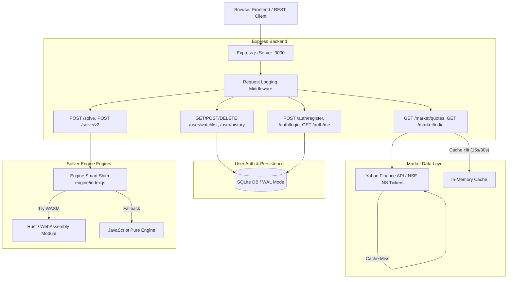

# QuantSolve ⚡ — Quantitative Equation Solver & Portfolio Optimizer

[](https://opensource.org/licenses/MIT)
[](https://nodejs.org/)
[](https://www.rust-lang.org/)
[-lightgrey.svg)](https://www.sqlite.org/)

**QuantSolve** is a high-performance, constraint-based multi-variable Diophantine equation solver and quantitative portfolio capital allocation platform. It translates complex mathematical expressions into non-negative whole-number solutions and bridges pure linear algebra with real-world financial portfolio optimization using live Indian Stock Market (NSE / Nifty) data.

Built with a dual-engine architecture (**JavaScript + WebAssembly via Rust**), Express backend API, SQLite persistence, and a responsive vanilla Web UI design system.

---

## 📚 Table of Contents

- [Key Features](#-key-features)
- [System Architecture](#-system-architecture)
- [Technology Stack](#-technology-stack)
- [Engine Execution Pipeline](#-engine-execution-pipeline)
- [Performance & Benchmarks](#-performance--benchmarks)
- [API Reference](#-api-reference)
- [Database Schema](#-database-schema)
- [Getting Started](#-getting-started)
- [Testing & Verification](#-testing--verification)
- [Directory Structure](#-directory-structure)

---

## ✨ Key Features

1. **High-Performance Equation Engine (JS + Rust/WASM)**
   - Solves linear Diophantine equations for non-negative integer solutions ($x_i \in \mathbb{Z}_{\ge 0}$).
   - Dynamic BODMAS/PEMDAS order of operations parsing, bracket expansion, and term aggregation.
   - Early contradiction detection via Greatest Common Divisor (GCD) divisibility tests.
   - WebAssembly acceleration compiled directly from Rust source with transparent JavaScript fallback shim.

2. **Quantitative Capital & Portfolio Optimizer**
   - Maps financial investment budgets into constraint equations: 
     $$p_1 x_1 + p_2 x_2 + \dots + p_n x_n = \text{Budget} - \text{Leftover}$$
   - Solves exact stock quantity allocations for custom portfolios under strict budget constraints.
   - Configurable per-ticker min/max quantities, lot sizes (even/odd/step), sector limits, and max leftover budget thresholds.

3. **Live NSE & Indian Stock Market Integration**
   - Real-time stock prices, market caps, indices (Nifty 50, Sensex, Bank Nifty, Nifty IT), top gainers/losers, and sector analytics via Yahoo Finance API with static fallback mode.
   - High-efficiency in-memory TTL caching layer (15s - 30s) to prevent API rate limiting.

4. **Multi-Page Web Dashboard & UI Design System**
   - **Equation Solver**: Interactive equation input, visual variable constraint builder, solution matrix table, and WASM performance badge.
   - **Portfolio Planner & Optimizer**: Live market asset selector, capital budgeting calculator, allocation score ranking, and strategy comparison.
   - **Market Overview**: Live market tickers, sector distribution charts, gainers/losers feed.
   - **Watchlist & History**: Saved user portfolio runs, persistent ticker watchlists, and interactive run rerun buttons.
   - **API Playground**: Built-in interactive documentation and live test execution panel for `/solve` and `/solve/v2`.

5. **Authentication & User Data Management**
   - JWT-based authentication system (`bcrypt` password hashing + signed JSON Web Tokens).
   - User-isolated persistent history logs and stock watchlists stored in SQLite.

---

## 🏗️ System Architecture



---

## 🛠️ Technology Stack

| Layer | Technologies & Tools |
| :--- | :--- |
| **Frontend** | HTML5, Vanilla JavaScript (ES6+ Modules), Vanilla CSS (Custom Design System with CSS variables, Glassmorphism, Micro-animations) |
| **Backend API** | Node.js, Express.js, CORS, JSON Web Tokens (`jsonwebtoken`), `bcryptjs` |
| **Database** | SQLite 3 via `better-sqlite3` with Write-Ahead Logging (`WAL` mode) and foreign key constraints enabled |
| **Engine (Native)** | Rust (`wasm-bindgen`, `serde_json`, strict type checking, non-allocating math operations) |
| **Engine (WebAssembly)** | WebAssembly compiled module (`quantsolve_engine_bg.wasm`) |
| **Market Data** | HTTPS client fetching live NSE data via Yahoo Finance API (`.NS` tickers) with automatic fallback system |
| **Testing** | Node.js Assert module (`api-smoke.js`, `smoke-test.js`, high-resolution timer benchmarks `bench.js`) |

---

## ⚙️ Engine Execution Pipeline

When an equation like `(10x + 20y) * 2 + 5z = 500` is submitted, the engine processes it through five distinct stages:

```
[ Raw String ] ➔ 1. Tokenizer ➔ 2. AST Parser ➔ 3. Normalizer & GCD Check ➔ 4. Constraint Evaluator ➔ 5. Backtracking Solver ➔ [ Solutions ]
```

1. **Tokenizer (`engine/tokenizer.js` / `tokenizer.rs`)**
   - Converts raw mathematical expressions into a stream of tokens (`NUMBER`, `VARIABLE`, `OPERATOR`, `LPAREN`, `RPAREN`, `EQUALS`).
   - Handles implicit multiplication (e.g. `2x` $\rightarrow$ `2 * x`, `10(a+b)` $\rightarrow$ `10 * (a+b)`).

2. **AST Parser (`engine/parser.js` / `parser.rs`)**
   - Constructs an Abstract Syntax Tree (AST) using recursive descent parsing.
   - Enforces standard mathematical precedence (**BODMAS / PEMDAS**).

3. **Normalizer (`engine/normalizer.js` / `normalizer.rs`)**
   - Expands nested brackets and combines like variable terms to form the canonical linear expression:
     $$a_1 x_1 + a_2 x_2 + \dots + a_n x_n = C$$
   - Executes **Greatest Common Divisor (GCD) early pruning**: If $\gcd(a_1, a_2, \dots, a_n) \nmid C$, it immediately returns non-existence of integer solutions in $O(n)$ time without launching the combinatorial search tree.

4. **Constraint Validator (`engine/constraints.js` / `constraints.rs`)**
   - Normalizes variable constraints (bounds $x \in [\text{min}, \text{max}]$, parity `even`/`odd`, step intervals).

5. **Diophantine Backtracking Solver (`engine/solver.js` / `solver.rs`)**
   - Solves the system using recursive branch-and-bound integer search.
   - Variables are sorted by coefficient size to maximize search tree pruning velocity.
   - Capped at configurable limit (default: 500 results).

---

## ⚡ Performance & Benchmarks

The computational core is benchmarked across increasing problem complexities comparing the Node.js JavaScript engine against the compiled Rust/WASM engine (`node scripts/bench.js`):

| Variable Complexity | Equation Benchmark Sample | JS Execution | Rust/WASM Execution | Performance Gain |
| :--- | :--- | :---: | :---: | :---: |
| **2-Variable** | `10x + 20y = 1000` | 0.17 ms | **0.09 ms** | **1.9× Speedup** |
| **3-Variable** | `10a + 15b + 20c = 1000` | 1.26 ms | **0.92 ms** | **1.4× Speedup** |
| **4-Variable** | `5a + 10b + 15c + 20d = 1000` | 0.61 ms | **0.65 ms** | Sub-millisecond |
| **5-Variable** | `5a + 8b + 10c + 15d + 20e = 500` | 0.94 ms | **1.03 ms** | Sub-millisecond |

> **Key Performance Highlights:**
> - **GCD Fast Exit**: Non-divisible equations fail in under **0.01 ms**.
> - **In-Memory Caching**: Market quote lookups respond in **< 1 ms** on cache hit.
> - **SQLite WAL Mode**: High concurrency write speed for user history logging.

---

## 📡 API Reference

### 1. Solve Equation (Legacy Endpoint)
`POST /solve`

**Request Body:**
```json
{
  "equation": "2x + 3y = 12",
  "constraints": {
    "x": { "even": true }
  }
}
```

**Response (Success - 200 OK):**
```json
[
  { "x": 0, "y": 4 },
  { "x": 6, "y": 0 }
]
```

---

### 2. Solve Equation (V2 Standardized Envelope)
`POST /solve/v2`

**Request Body:**
```json
{
  "equation": "10a + 15b + 20c = 300",
  "constraints": {
    "a": { "min": 1, "max": 10 }
  }
}
```

**Response (Success - 200 OK):**
```json
{
  "ok": true,
  "requestId": "c7f1a8e2-45d2-4321-b987-123456789abc",
  "data": [
    { "a": 2, "b": 0, "c": 14 },
    { "a": 2, "b": 4, "c": 11 }
  ],
  "message": null,
  "meta": { "count": 2 }
}
```

**Response (No Solutions / Error - 200 OK):**
```json
{
  "ok": false,
  "requestId": "c7f1a8e2-45d2-4321-b987-123456789abc",
  "data": null,
  "message": "No whole-number solutions exist."
}
```

---

### 3. Live Indian Market Data
`GET /market/india`

Returns live NSE stock quotes (Reliance, TCS, Infosys, HDFC Bank, etc.), market indices (Nifty 50, Sensex), top gainers/losers, and sector averages.

---

### 4. Authentication Endpoints
- `POST /auth/register`: Create user account (`email`, `name`, `password`).
- `POST /auth/login`: Authenticate and receive JWT token.
- `GET /auth/me`: Verify session and retrieve active user profile.

---

### 5. User Data Management (Requires JWT `Authorization: Bearer <token>`)
- `GET /user/watchlist`: Get user's saved stock watchlist.
- `POST /user/watchlist`: Add ticker to watchlist (`{ "symbol": "RELIANCE" }`).
- `DELETE /user/watchlist/:symbol`: Remove ticker from watchlist.
- `GET /user/history`: Retrieve saved portfolio solver execution history.
- `POST /user/history`: Save a portfolio optimization run.

---

## 🗄️ Database Schema

Database path: `quantsolve.db` (SQLite with `WAL` journal mode).

```sql
CREATE TABLE users (
  id         INTEGER PRIMARY KEY AUTOINCREMENT,
  email      TEXT    UNIQUE NOT NULL COLLATE NOCASE,
  name       TEXT    NOT NULL,
  password   TEXT    NOT NULL,
  created_at INTEGER NOT NULL DEFAULT (unixepoch())
);

CREATE TABLE watchlist (
  id         INTEGER PRIMARY KEY AUTOINCREMENT,
  user_id    INTEGER NOT NULL REFERENCES users(id) ON DELETE CASCADE,
  symbol     TEXT    NOT NULL,
  added_at   INTEGER NOT NULL DEFAULT (unixepoch()),
  UNIQUE(user_id, symbol)
);

CREATE TABLE history (
  id           TEXT    PRIMARY KEY,
  user_id      INTEGER NOT NULL REFERENCES users(id) ON DELETE CASCADE,
  tickers      TEXT    NOT NULL,   -- JSON array
  budget       REAL    NOT NULL,
  max_leftover REAL    NOT NULL,
  equation     TEXT,
  source       TEXT,
  total        INTEGER,
  best_pct     REAL,
  portfolios   TEXT,               -- JSON array (top 10)
  created_at   INTEGER NOT NULL DEFAULT (unixepoch())
);
```

---

## 🚀 Getting Started

### Prerequisites
- **Node.js**: v18.0.0 or higher
- **npm**: v9.0.0 or higher

### Installation

1. **Clone the repository:**
   ```bash
   git clone https://github.com/Pavanboga07/Team-Diamonds.git
   cd Team-Diamonds
   ```

2. **Install Node.js dependencies:**
   ```bash
   npm install
   ```

3. **Start the backend server:**
   ```bash
   npm start
   ```
   *The server starts on `http://localhost:3000`.*

4. **Access the application dashboard:**
   Open `http://localhost:3000` in your web browser.

---

## 🧪 Testing & Verification

QuantSolve comes with a multi-layered test suite to verify math correctness, WASM engine output parity, and API response integrity.

### 1. Engine & WASM Parity Test
Verifies that the JS engine and WASM binary produce matching solutions across canonical examples:
```bash
npm test
```

### 2. Performance Benchmark
Compares execution speed between JavaScript and Rust/WASM implementations:
```bash
npm run bench
```

### 3. API Smoke Test
Tests all REST API endpoints against a running server:
```bash
# Ensure server is running in another terminal via 'npm start'
npm run smoke:api
```

---

## 📂 Directory Structure

```
Orchathon/
├── engine/                      # Core Math & Solver Engine
│   ├── index.js                 # Smart Shim (WASM dynamically loaded, JS fallback)
│   ├── engine.js                # Core JS Engine Facade
│   ├── tokenizer.js             # Expression Lexer / Tokenizer
│   ├── parser.js                # AST Parser (BODMAS support)
│   ├── normalizer.js            # Linear Normalizer & GCD Fast Check
│   ├── constraints.js           # Variable Constraint Validator
│   ├── solver.js                # Multi-variable Backtracking Solver
│   ├── rust/                    # Rust Source Code
│   │   ├── src/                 # tokenizer.rs, parser.rs, normalizer.rs, solver.rs
│   │   ├── Cargo.toml           # Rust Crate Metadata
│   └── wasm/                    # WebAssembly Module
│       ├── quantsolve_engine.js # WASM JS Bindings
│       └── quantsolve_engine_bg.wasm # Compiled WebAssembly Binary
├── src/                         # Express Backend Application
│   ├── config.js                # Environment Config & JWT Secrets
│   ├── db/                      # SQLite Connection & Initialization
│   ├── middleware/              # Logging & JWT Auth Middleware
│   └── routes/                  # Express Routers
│       ├── solve.js             # /solve & /solve/v2 endpoints
│       ├── market.js            # /market/quotes endpoint
│       ├── india-market.js      # /market/india endpoint
│       ├── auth.js              # /auth/* registration & login
│       └── user-data.js         # /user/* watchlist & history
├── pages/                       # Multi-Page Web Application Frontend
│   ├── solver.html / solver.js  # Equation Solver Workspace
│   ├── planner.html / planner.js# Portfolio Allocation Planner
│   ├── optimizer.html / optimizer.js # Deep Capital Optimizer
│   ├── market.html / market.js  # Indian Stock Market Dashboard
│   ├── watchlist.html / watchlist.js # Saved User Watchlist
│   ├── history.html / history.js# Run History Log
│   ├── compare.html / compare.js# Visual Strategy Comparison
│   └── api-docs.html / api-docs.js # Interactive API Documentation
├── components/                  # Shared UI Elements & Header Navigation
│   └── layout.js                # Global Nav & Theme Management
├── lib/                         # Client Utilities
│   ├── auth-client.js           # Client Authentication Handler
│   ├── market-client.js         # Client Market Data API Client
│   └── storage.js               # Local Storage Strategy Cache
├── scripts/                     # Test & Benchmark Scripts
│   ├── smoke-test.js            # Engine Parity Tests
│   ├── api-smoke.js             # REST API Verification
│   └── bench.js                 # Engine Benchmarking Utility
├── app.css / style.css          # Design System Stylesheets
├── server.js                    # Express Application Entry Point
├── package.json                 # Project Manifest & NPM Scripts
└── README.md                    # Project Documentation
```

---

## 📜 License

This project is licensed under the [MIT License](LICENSE).
